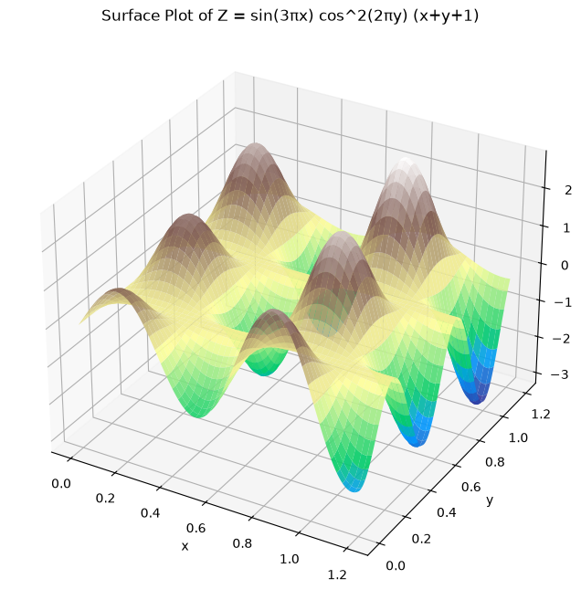
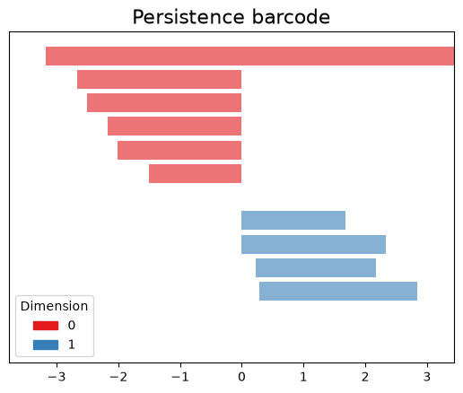
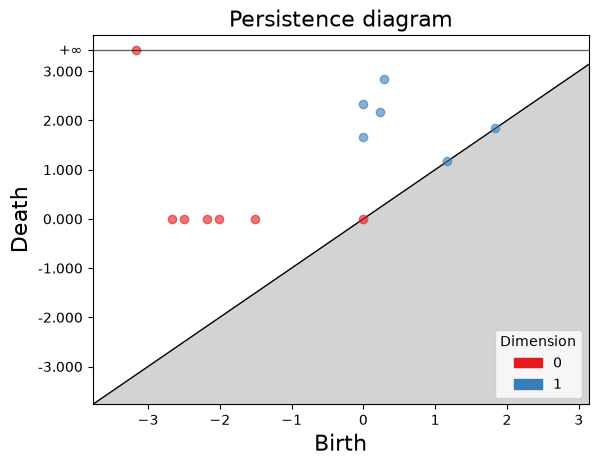

### Pechstre: a **Pe**rsistence method for **Ch**unks **Stre**aming
This project computes the persistent homology of arrays that expand in a streaming fashion, meaning chunks arrive and keep incrementing a base array.

One way to compute an streaming array's persistence is, every time a new chunk is incremented, to re-compute the persistence of the entire array. While this works fine, it does unnecessary work, especially for massive data like maps or videos.

The filtration method used to process the birth and death of the data depends on the modality. For instance:
- 2D arrays, like images, commonly use sublevel/superlevel set filtration based on pixel intensity or a scalar function
- point clouds use distance-based filtration like Vietoris-Rips, Alpha/Delaunay, Čech, or witness complexes
- time series often do sublevel set on the signal, or alternately, undergo time delay (Takens) embedding to turn into a point cloud, after which distance-based filtrations are applied
- Graphs/networks mostly use weight filtrations on edges or nodes

Our method focuses on the sublevel set filtration and uses a cubical complex.

We benchmark against the libraries Gudhi and CubicalRipser.

