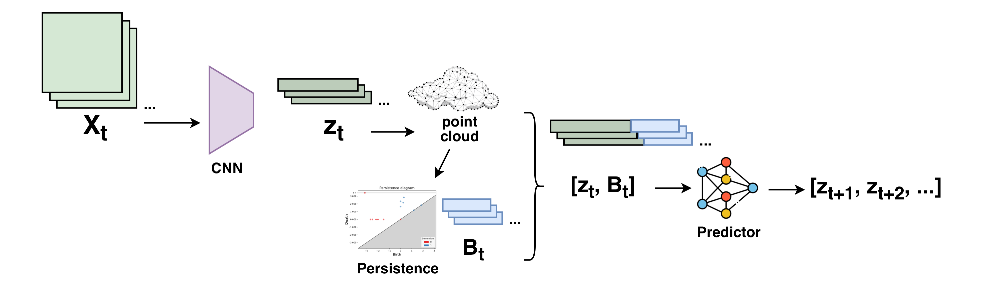

# Gelareto

Geometry-preserving representation learning with topological signals for prediction.

This repository contains experiments combining autoencoders, latent-space geometry,
persistent-homology descriptors, and sequence forecasting across synthetic and
real-world datasets.



*Main architecture of Gelareto.*

The streamed-prefix persistence implementation now lives in the separate
[`Pechstre`](https://github.com/abiadf/Pechstre) repository.

## Setup

Requires Python 3.10 or newer.

```bash
uv sync
```

Run the main experiments with:

```bash
bash run_ml_persistence.sh
```
